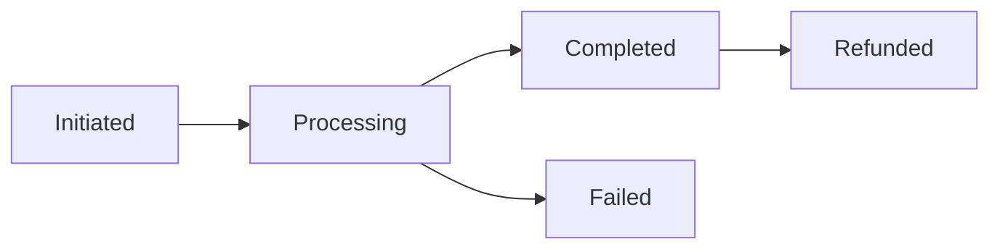

# Integration Patterns Guide

## Event Handling

### Payment Events
```typescript
interface PaymentEvent {
    type: 'payment.success' | 'payment.failed' | 'payment.pending';
    payload: {
        reference: string;
        amount: number;
        currency: string;
        userId: string;
    };
}
```

### Discord Integration
```typescript
interface DiscordNotification {
    type: 'dm' | 'channel';
    message: string;
    embed?: DiscordEmbed;
    components?: DiscordComponent[];
}
```

## State Management

### Transaction States


### Points System
```typescript
interface PointsTransaction {
    userId: string;
    amount: number;
    type: 'purchase' | 'transfer' | 'refund';
    reference: string;
}
```

## Error Recovery

### Retry Patterns
```javascript
const RETRY_CONFIG = {
    maxAttempts: 3,
    backoffMultiplier: 2,
    initialDelay: 1000
};
```
