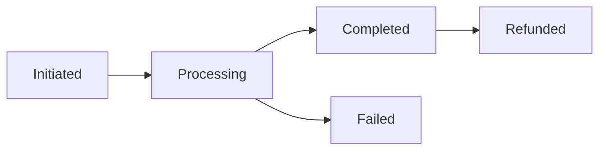

# Integration Patterns Guide

## Event Handling

### Payment Events
```typescript
interface PaymentEvent {
    type: 'payment.success' | 'payment.failed' | 'payment.pending';
    payload: {
        reference: string;
        amount: number;
        currency: string;
        userId: string;
    };
}
```

### Discord Integration
```typescript
interface DiscordNotification {
    type: 'dm' | 'channel';
    message: string;
    embed?: DiscordEmbed;
    components?: DiscordComponent[];
}
```

## Payment Integration

### Transaction Flow
```typescript
interface TransactionFlow {
    steps: {
        initiate: () => Promise<string>;
        verify: (reference: string) => Promise<boolean>;
        complete: (reference: string) => Promise<void>;
        award_points: (userId: string, points: number) => Promise<void>;
    };
    rollback: {
        refund: (reference: string) => Promise<void>;
        revert_points: (userId: string, points: number) => Promise<void>;
    };
}
```

### Webhook Processing
```typescript
interface WebhookHandler {
    verify_signature: (payload: any, signature: string) => boolean;
    process_event: (event: PaymentEvent) => Promise<void>;
    notify_user: (userId: string, status: string) => Promise<void>;
}
```

## Payment Integration Patterns

### Observer Pattern
```typescript
interface PaymentObserver {
    onTransactionCreated(transaction: Transaction): void;
    onPaymentCompleted(transaction: Transaction): void;
    onPointsAwarded(userId: string, points: number): void;
    onError(error: PaymentError): void;
}
```

### Command Pattern
```typescript
interface PaymentCommand {
    execute(): Promise<void>;
    undo(): Promise<void>;
    validate(): boolean;
}

class ProcessPaymentCommand implements PaymentCommand {
    constructor(private transaction: Transaction) {}
    // Implementation details
}
```

## State Management

### Transaction States


### Points System
```typescript
interface PointsTransaction {
    userId: string;
    amount: number;
    type: 'purchase' | 'transfer' | 'refund';
    reference: string;
}
```

## Error Recovery

### Retry Patterns
```javascript
const RETRY_CONFIG = {
    maxAttempts: 3,
    backoffMultiplier: 2,
    initialDelay: 1000
};
```

### Error Recovery
```typescript
interface ErrorRecovery {
    max_retries: number;
    backoff_ms: number;
    timeout_ms: number;
    recovery_strategies: {
        [key: string]: () => Promise<void>;
    }
}
```

## Event Handling Patterns

### Event Queue
```typescript
interface PaymentEventQueue {
    priority: {
        HIGH: ['payment.failed', 'payment.error'],
        MEDIUM: ['payment.success', 'points.awarded'],
        LOW: ['payment.initiated', 'analytics']
    };
    handlers: {
        [eventType: string]: EventHandler[];
    };
    retryPolicy: {
        maxAttempts: number;
        backoffMs: number;
    };
}
```

### Event Broadcasting
```typescript
const EVENT_CHANNELS = {
    payment: {
        internal: ['database', 'cache', 'metrics'],
        external: ['discord', 'webhook'],
        audit: ['logger', 'monitoring']
    }
};
```

### Circuit Breaker
```typescript
interface CircuitConfig {
    failureThreshold: 5,
    resetTimeout: 30000,
    monitoredErrors: [
        'ECONNREFUSED',
        'ETIMEDOUT',
        'ECONNRESET'
    ]
}
```
