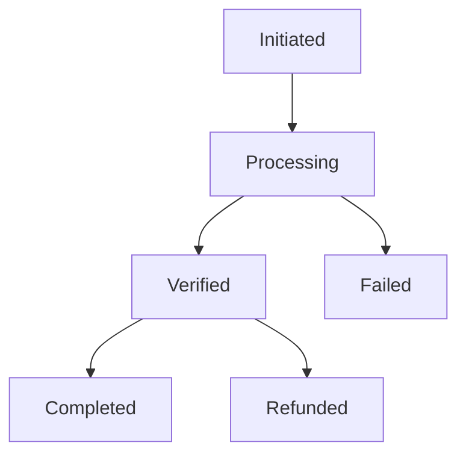
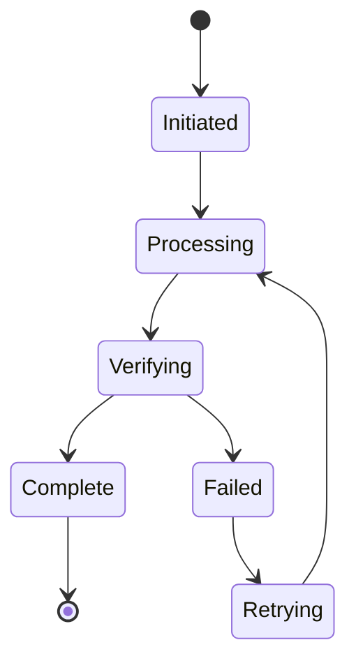

# Transaction Handling Guide

## Processing Flow

### State Machine


### Validation Rules
```typescript
interface TransactionRules {
    minAmount: 10.00,
    maxAmount: 500000.00,
    currencies: ['ZAR'],
    timeout: 900000,  // 15 minutes
    retryAttempts: 3
}
```

### Point Calculation
```javascript
const POINT_CONVERSION = {
    ZAR: {
        rate: 100,  // points per ZAR
        minimum: 1000,
        maximum: 50000
    }
};
```

## Transaction Processing

### Queue Management
```typescript
interface QueueConfig {
    maxSize: 1000,
    processingTimeout: 30000,
    retryStrategy: {
        attempts: 3,
        backoff: 'exponential',
        initialDelay: 1000
    }
}
```

### Transaction Lifecycle


### Deadlock Prevention
```javascript
const DEADLOCK_CONFIG = {
    lockTimeout: 30000,
    maxLockAttempts: 3,
    releaseStrategy: 'force_after_timeout'
};
```

## Transaction Recovery

### Auto-Recovery
1. Network Timeout
2. Provider Error
3. Webhook Failure
4. Database Error
5. Points Distribution
