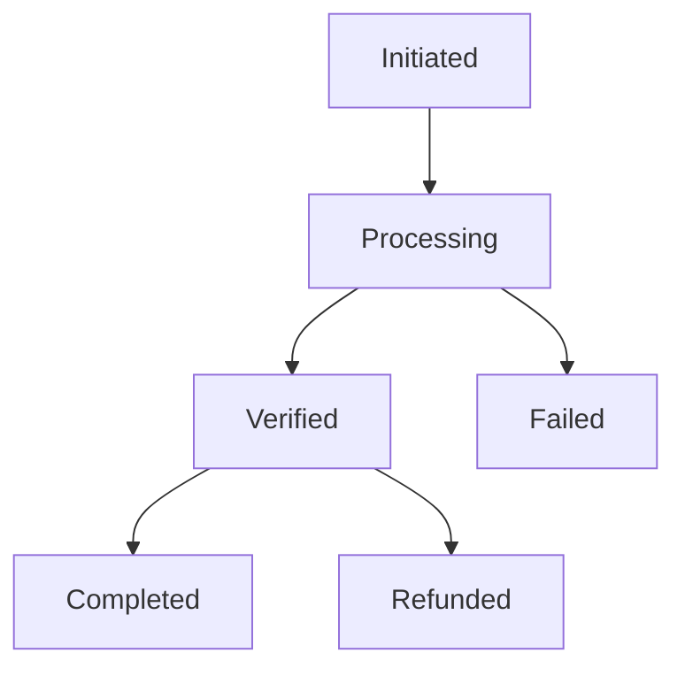

# Transaction Handling Guide

## Processing Flow

### State Machine


### Validation Rules
```typescript
interface TransactionRules {
    minAmount: 10.00,
    maxAmount: 500000.00,
    currencies: ['ZAR'],
    timeout: 900000,  // 15 minutes
    retryAttempts: 3
}
```

### Point Calculation
```javascript
const POINT_CONVERSION = {
    ZAR: {
        rate: 100,  // points per ZAR
        minimum: 1000,
        maximum: 50000
    }
};
```

## Transaction Recovery

### Auto-Recovery
1. Network Timeout
2. Provider Error
3. Webhook Failure
4. Database Error
5. Points Distribution
