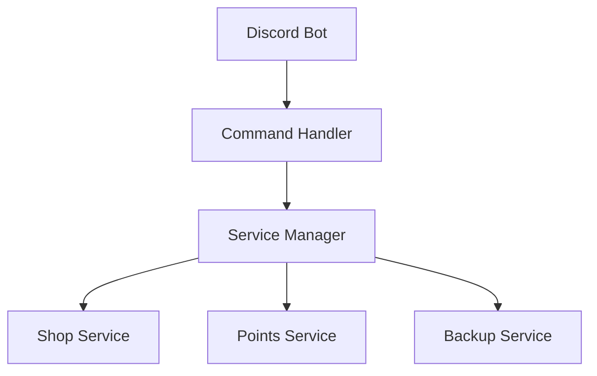

# Architecture

## Core Services

### Base Service
All services extend the BaseService class which provides:
- Configuration management
- Event handling
- Error recovery
- Lifecycle management

### Service Communication
Services communicate through:
- Event system
- Message queue
- WebSocket for real-time updates

## Directory Structure
```
src/
├── commands/      # Discord commands
├── services/      # Core services
├── utils/         # Utilities
└── monitoring/    # System monitoring
```

## Service Dependencies

